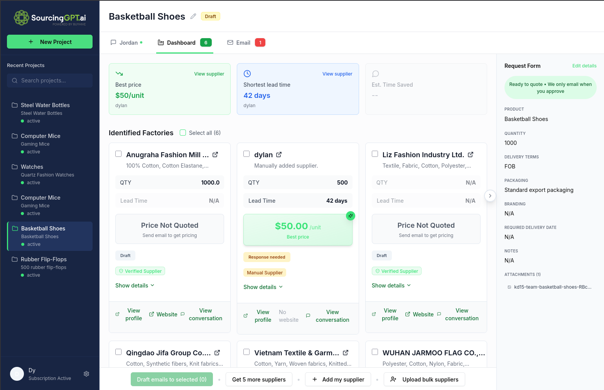
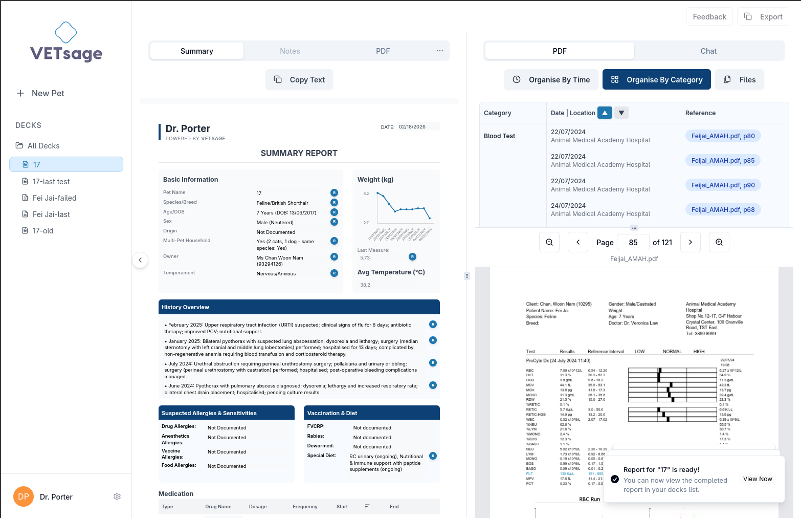

# Dylan Porter

**Full Stack & AI Dev · CS @ HKU · IBM Z Student Ambassador**

Hong Kong SAR

Contract developer building production AI systems for startups across sourcing, healthcare, and EdTech.
I care about shipping things that actually work at scale.

---

### Where I work

- **Full Stack AI Engineer — [Collective Global](https://collectiveglobal.net)**
  End-to-end AI for startup clients: LLM pipelines, AWS infra, React/TypeScript frontends.
- **Coding Instructor — [BSD Education](https://bsd.education)**
  Web dev, Python, AI, game dev · 100+ students aged 7–14.
- **IBM Z Student Ambassador — HKU**
  Campus rep · spoke at IBM Z Day 2025 & LinuxONE Community Day 2025 (~1,000 attendees).

### Products I've shipped through Collective

<table>
<tr>
<td width="50%" valign="top">

  
<b><a href="https://sourcinggpt.ai">SourcingGPT</a></b> — agentic B2B supplier sourcing platform. Antler Inception SG20.
</td>
<td width="50%" valign="top">

  
<b><a href="https://vetsage.webflow.io/">VETsage</a></b> — RAG + OCR clinical report system, used by vet clinics internationally.
</td>
</tr>
</table>

### Stack

### Elsewhere

